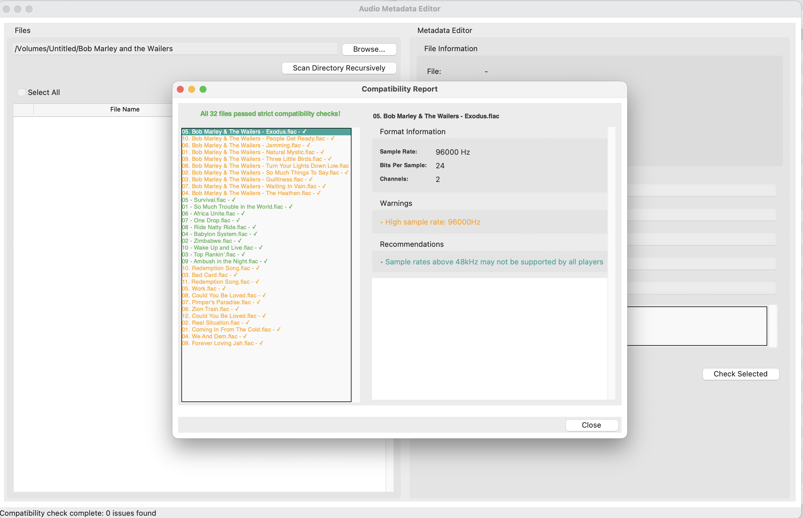

# Audio Metadata Editor

A cross-platform desktop application for editing and managing metadata in audio files.



[](https://ko-fi.com/P5P81FA6UA)

## Features

- Edit audio file metadata (ID3 tags for MP3, Vorbis Comments for FLAC/OGG, INFO chunks for WAV)
- Compatibility checker for audio files to ensure they play correctly on various devices
- Batch editing capabilities for multiple files
- Recursive directory scanning for compatibility issues
- Support for multiple audio formats (MP3, FLAC, OGG, WAV)
- Clean up macOS resource files (.\_\* files)
- User-friendly interface with simple controls

## Download

Get the latest version for your platform from the [Releases](https://github.com/geleeroyale/AudioMetaEditor/releases) page:

- **Windows**: Download the `.exe` file
- **macOS**: Download the `.app.zip` file (Universal Binary for Intel and Apple Silicon)
- **Linux**: Download the `.zip` file

## Installation

### Windows

- Download the `.exe` file from the Releases page
- Double-click to run the application (no installation required)

### macOS

- Download the `.app.zip` file
- Unzip the file
- Move the `.app` file to your Applications folder
- Right-click the app and select "Open" (required for the first run due to macOS security)

### Linux

- Download the `.zip` file
- Extract the contents
- Open a terminal in the extracted directory
- Run the application using the provided wrapper script: `./run-audiometaeditor.sh`
- Requirements: Python 3.8+ with tkinter (`sudo apt-get install python3-tk`)

## Usage

### Basic Usage

1. Open the application
2. Use "File > Open" to select an audio file
3. Edit the metadata fields
4. Click "Save" to update the file

### Batch Editing

1. Use "File > Open Multiple Files" to select multiple audio files
2. Edit the common metadata fields
3. Click "Save All" to update all files

### Compatibility Check

1. Select a file or multiple files
2. Click "Tools > Check Compatibility"
3. Review the compatibility report for issues
4. Use the "Fix Selected" buttons to address specific issues

### Recursive Directory Scanning

1. Click "Tools > Scan Directory"
2. Select a directory to scan recursively
3. Review the compatibility report for all audio files in the directory tree

### Cleanup macOS Resource Files

1. Click "Tools > Delete macOS Resource Files"
2. Select a directory containing resource files (.\_\*)
3. Confirm the deletion when prompted

## Development

### Requirements

- Python 3.8 or higher
- Dependencies:
  - mutagen (for audio metadata handling)
  - tkinter (for GUI)

### Setup Development Environment

1. Clone the repository

   ```
   git clone https://github.com/geleeroyale/AudioMetaEditor.git
   cd AudioMetaEditor
   ```

2. Create a virtual environment (optional but recommended)

   ```
   python -m venv venv
   source venv/bin/activate  # On Windows: venv\Scripts\activate
   ```

3. Install dependencies

   ```
   pip install mutagen
   ```

4. Run the application
   ```
   python audio_metadata_editor.py
   ```

### Building from Source

Building executables requires PyInstaller:

```
pip install pyinstaller
```

Build commands:

- Windows: `pyinstaller --onefile --windowed --icon=app_icon.ico audio_metadata_editor.py`
- macOS: `pyinstaller --windowed --icon=app_icon.icns --target-architecture universal2 audio_metadata_editor.py`
- Linux: `pyinstaller --onefile --windowed audio_metadata_editor.py`

## License

[MIT License](LICENSE)

## Acknowledgements

- [Mutagen](https://mutagen.readthedocs.io/) - Used for audio metadata handling
- [Python](https://www.python.org/) - Programming language
- [Tkinter](https://docs.python.org/3/library/tkinter.html) - GUI toolkit

[](https://ko-fi.com/P5P81FA6UA)
